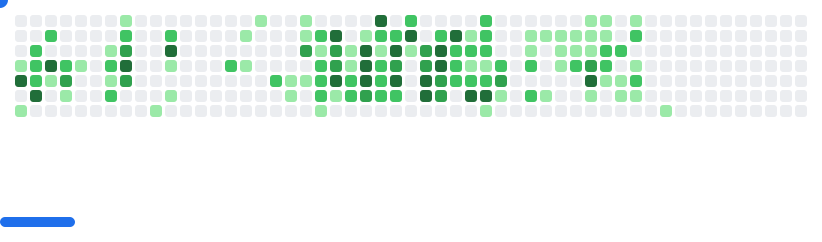

<h1>Hi there , I'm Dawood Mehmood </h1>

-  🧠  I'm learning Scalable System Design and Security First Development 
  
- 🤝  I'm open to collaborating on Web based projects especially MERN stack and Nextjs based

- 📩 Reach out to me at: [dawoodmehmood52222@gmail.com](dawoodmehmood52222@gmail.com)

- 📄 Wanna know about my experiences: [https://www.linkedin.com/in/dawoodmehmood/](https://www.linkedin.com/in/dawoodmehmood/)

# 💻 Languages, Frameworks & Tools:

<picture>
    <source media="(prefers-color-scheme: dark)" srcset="https://skillicons.dev/icons?i=html%2Ccss%2Cjavascript%2Cts%2Cpython%2Csolidity%2Creact%2Cnextjs%2Ctailwind%2Cbootstrap%2Cjquery%2Csass%2Cnodejs%2Cexpress%2Cnestjs%2Cflask%2Cfastapi%2Cmongodb%2Cmysql%2Cpostgres%2Cprisma%2Csequelize%2Cdocker%2Cfirebase%2Cgraphql%2Cpostman%2Cnpm%2Cyarn%2Cgit%2Caws&perline=15&theme=dark" />
    <source media="(prefers-color-scheme: light), (prefers-color-scheme: no-preference)" srcset="https://skillicons.dev/icons?i=html%2Ccss%2Cjavascript%2Cts%2Cpython%2Csolidity%2Creact%2Cnextjs%2Ctailwind%2Cbootstrap%2Cjquery%2Csass%2Cnodejs%2Cexpress%2Cnestjs%2Cflask%2Cfastapi%2Cmongodb%2Cmysql%2Cpostgres%2Cprisma%2Csequelize%2Cdocker%2Cfirebase%2Cgraphql%2Cpostman%2Cnpm%2Cyarn%2Cgit%2Caws&perline=15&theme=light" />
    
</picture>

# 📊 GitHub Stats:

  <picture>
        <source media="(prefers-color-scheme: dark)" srcset="https://streak-stats.demolab.com/?user=DawoodMehmood&theme=react&hide_border=true" />
        <source media="(prefers-color-scheme: light), (prefers-color-scheme: no-preference)" srcset="https://github-readme-streak-stats-salesp07.vercel.app/?user=DawoodMehmood&count_private=true&show_icons=true&theme=default&rank_icon=github&border_radius=10&border=61dafb" />
        
  </picture>

  

<picture>
  <source media="(prefers-color-scheme: dark)" srcset="https://raw.githubusercontent.com/DawoodMehmood/DawoodMehmood/output/github-contribution-grid-snake-dark.svg" />
  <source media="(prefers-color-scheme: light), (prefers-color-scheme: no-preference)" srcset="https://raw.githubusercontent.com/DawoodMehmood/DawoodMehmood/output/github-contribution-grid-snake.svg" />
  
</picture>

> <small>Like the snake eating contribution graph? Create your own by following 3 simple steps → 
<a href="https://github.com/DawoodMehmood/commits-eater">DawoodMehmood/commits-eater</a></small>

 

<picture>
  <source
    media="(prefers-color-scheme: dark)"
    srcset="images/breakout-dark.svg"
  />
  <source
    media="(prefers-color-scheme: light)"
    srcset="images/breakout-light.svg"
  />
  
</picture>

> <small>Like the gamified contribution graph? Create your own by following 3 simple steps → 
<a href="https://github.com/DawoodMehmood/commits-breaker">DawoodMehmood/commits-breaker</a></small>

