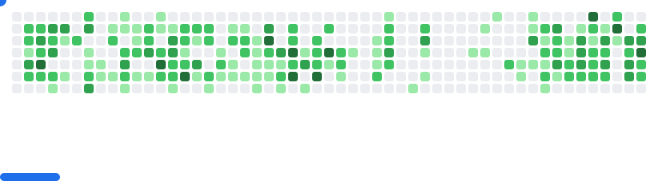

<h1 align="center">Hi there , I'm Dawood Mehmood </h1>

-  🧠  I'm learning System Design and AI Agents
  
- 🤝  I'm open to collaborating on Web based projects especially MERN stack and Nextjs based

- 📩 Reach out to me at: [dawoodmehmood52222@gmail.com](dawoodmehmood52222@gmail.com)

- 👨‍💻 All of my projects are available at: [https://github.com/DawoodMehmood](https://github.com/DawoodMehmood)

- 📄 Wanna know about my experiences: [https://www.linkedin.com/in/dawoodmehmood/](https://www.linkedin.com/in/dawoodmehmood/)

# 💻 Tech Stack:
     

 
# 📊 GitHub Stats:

<picture>
  <source
    media="(prefers-color-scheme: dark)"
    srcset="images/breakout-dark.svg"
  />
  <source
    media="(prefers-color-scheme: light)"
    srcset="images/breakout-light.svg"
  />
  
</picture>
